# **Manual de Construcción y Configuración**

## **Contenido**   
- [Tablas de configuraciones](#idTBConf)
- [Topología 1](#idTopo1)
- [Topología 2](#idTopo2)
- [Topología 3](#idTopo3)
- [Configuración VPN ](#idVPN)

## **Tabla de configuraciones**<a name="idTBConf"></a>
|    DISPOSITIVO    	| VLAN 	|   DIRECCION IP  	|  MASCARA DE RED 	|     GATEWAY     	|
|:-----------------:	|:----:	|:---------------:	|:---------------:	|:---------------:	|
|      ADMIN 1      	|  10  	|  192.168.126.2  	| 255.255.255.192 	|  192.168.126.1  	|
|      ADMIN 2      	|  10  	|  192.168.126.3  	| 255.255.255.192 	|  192.168.126.1  	|
|    PC1 (CONTA1)   	|  20  	|  192.168.126.66 	| 255.255.255.192 	|  192.168.126.65 	|
|    PC2 (CONTA2)   	|  20  	|  192.168.126.67 	| 255.255.255.192 	|  192.168.126.65 	|
|      WEBCONTA     	|  20  	|  192.168.126.68 	| 255.255.255.192 	|  192.168.126.65 	|
|   PC3 (VENTAS1)   	|  30  	| 192.168.126.130 	| 255.255.255.192 	| 192.168.126.129 	|
|   PC4 (VENTAS2)   	|  30  	| 192.168.126.131 	| 255.255.255.192 	| 192.168.126.129 	|
|      WEBPAGE      	|  30  	| 192.168.126.132 	| 255.255.255.192 	| 192.168.126.129 	|
| PC5 (INFORMATICA) 	|  30  	| 192.168.126.133 	| 255.255.255.192 	| 192.168.126.129 	|
|         BD        	|  30  	| 192.168.126.134 	| 255.255.255.192 	| 192.168.126.129 	|

## **Tabla de configuraciones de la nube**
| TOPOLOGIA |     LOCAL PORT     	|  REMOTE HOST	|   REMOTE PORT  	|
|:-------:	|:-------------------:	|:-----------:	|:---------------:	|
|    1   	|         3223      	|    10.8.0.2  	|       3550     	|
|    2   	|         3550      	|    10.8.0.4   |       3223    	| 
|    2   	|         5671      	|    10.8.0.2   |       3525    	| 
|    2   	|         3525      	|    10.8.0.3   |       5671    	| 

## **Topología 1**<a name="idTopo1"></a>
<div align="center">
    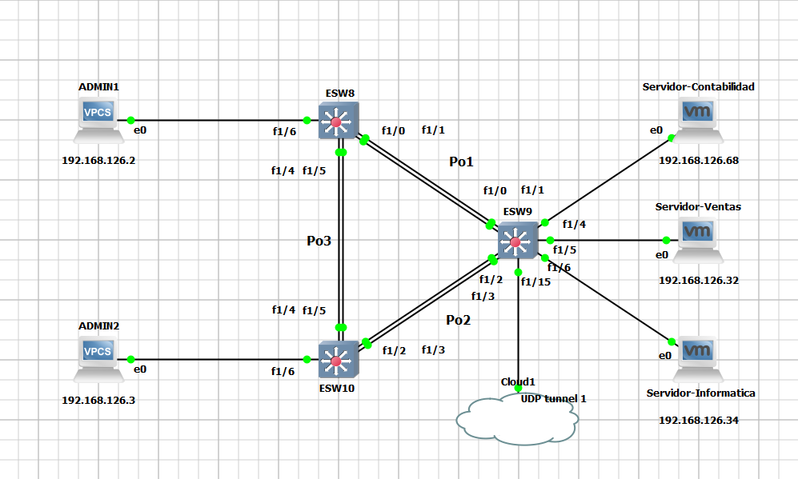
    <p align="center">Diseño Topología 1</p>
</div>

```bash
-------------------------------------------- port-channel
-------- SW8
conf t

int range f1/0 -1
channel-group 1 mode on
exit

int range f1/4 -5
channel-group 3 mode on
exit

end
------------ 
-------- SW9
conf t

int range f1/0 -1
channel-group 1 mode on
exit

int range f1/2 -3
channel-group 2 mode on
exit

end
------------ 
-------- SW10
conf t

int range f1/2 -3
channel-group 2 mode on
exit

int range f1/4 -5
channel-group 3 mode on
exit

end
-------------------------------------------- TRONCALES
-------- SW8
conf t

int Po1
switchport mode trunk
switchport trunk allowed vlan 1,10,20,30,1002-1005
exit

int Po3
switchport mode trunk
switchport trunk allowed vlan 1,10,20,30,1002-1005
exit

end
------------ 
-------- SW9
conf t

int Po1
switchport mode trunk
switchport trunk allowed vlan 1,10,20,30,1002-1005
exit

int Po2
switchport mode trunk
switchport trunk allowed vlan 1,10,20,30,1002-1005
exit

int fa1/15
switchport mode trunk
switchport trunk allowed vlan 1,10,20,30,1002-1005
exit

end
------------ 
-------- SW10
conf t

int Po2
switchport mode trunk
switchport trunk allowed vlan 1,10,20,30,1002-1005
exit

int Po3
switchport mode trunk
switchport trunk allowed vlan 1,10,20,30,1002-1005
exit

end
-------------------------------------------- VTP
-------- SW8
conf t

vtp domain grupo26
vtp password grupo26
vtp mode client

end
------------ 
-------- SW9
conf t

vtp domain grupo26
vtp password grupo26
vtp mode client

end
------------ 
-------- SW10
conf t

vtp domain grupo26
vtp password grupo26
vtp mode client

end
-------------------------------------------- SAVE
copy running-config startup-config
```
## Servidor Informatica
<div align="center">
    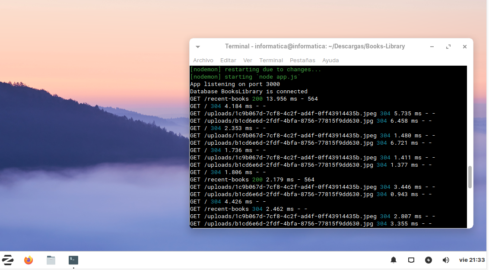
    <p align="center">Terminal Server Backend</p>
</div>

## Servidor Ventas
<div align="center">
    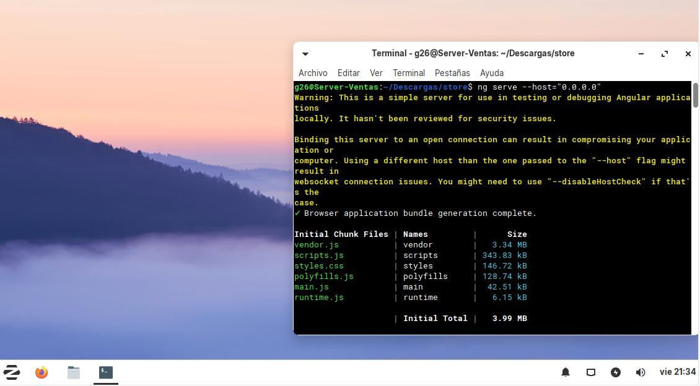
    <p align="center">Terminal Server Frontend</p>
</div>

<div align="center">
    
    <p align="center">Pagina Web</p>
</div>

## **Topología 2**<a name="idTopo2"></a>
<div align="center">
    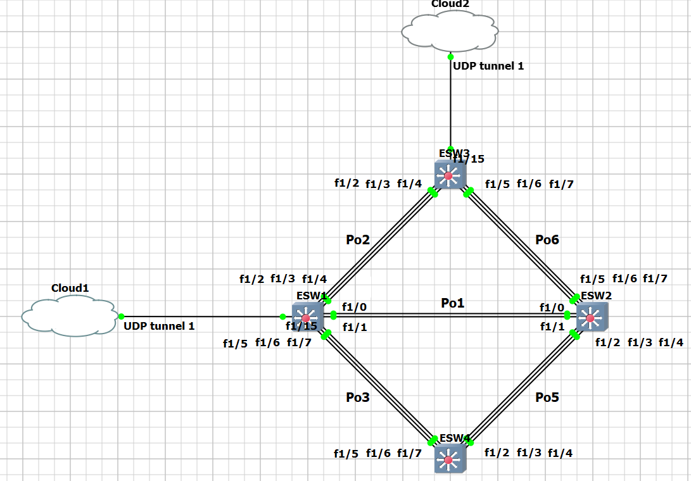
    <p align="center">Diseño Topología 2</p>
</div>

```bash
-------------------------------------------- port-channel
-------- SW1
conf t

int range f1/0 -1
channel-group 1 mode on
exit

int range f1/2 -4
channel-group 2 mode on
exit

int range f1/5 -7
channel-group 3 mode on
exit

show etherchannel port-channel
show etherchannel summary

end
------------ 
-------- SW2
conf t

int range f1/0 -1
channel-group 1 mode on
exit

int range f1/5 -7
channel-group 4 mode on
exit

int range f1/2 -4
channel-group 5 mode on
exit

end
------------ 
-------- SW3
conf t

int range f1/2 -4
channel-group 2 mode on
exit

int range f1/5 -7
channel-group 4 mode on
exit

end
------------ 
-------- SW4
conf t

int range f1/5 -7
channel-group 3 mode on
exit

int range f1/2 -4
channel-group 5 mode on
exit

end
-------------------------------------------- VTP
-------- SW1
conf t

vtp domain grupo26
vtp password grupo26
vtp mode server

end
------------ 
-------- SW2
conf t

vtp domain grupo26
vtp password grupo26
vtp mode client

end
------------ 
-------- SW3
conf t

vtp domain grupo26
vtp password grupo26
vtp mode client

end
------------ 
-------- SW4
conf t

vtp domain grupo26
vtp password grupo26
vtp mode client

end
-------------------------------------------- VLAN
-------- SW1
conf t 

vlan 10
name ADMINISTRACION
exit

vlan 20
name CONTABILIDAD
exit

vlan 30
name VENTAS-INFORMATICA
exit

end
-------------------------------------------- TRONCALES
-------- SW1
conf t

int Po1
switchport mode trunk
switchport trunk allowed vlan 1,10,20,30,1002-1005
exit

int Po2
switchport mode trunk
switchport trunk allowed vlan 1,10,20,30,1002-1005
exit

int Po3
switchport mode trunk
switchport trunk allowed vlan 1,10,20,30,1002-1005
exit

int fa1/15
switchport mode trunk
switchport trunk allowed vlan 1,10,20,30,1002-1005
exit

end
------------ 
-------- SW2
conf t

int Po1
switchport mode trunk
switchport trunk allowed vlan 1,10,20,30,1002-1005
exit

int Po4
switchport mode trunk
switchport trunk allowed vlan 1,10,20,30,1002-1005
exit

int Po5
switchport mode trunk
switchport trunk allowed vlan 1,10,20,30,1002-1005
exit

end
------------ 
-------- SW3
conf t

int Po2
switchport mode trunk
switchport trunk allowed vlan 1,10,20,30,1002-1005
exit

int Po4
switchport mode trunk
switchport trunk allowed vlan 1,10,20,30,1002-1005
exit

int fa1/15
switchport mode trunk
switchport trunk allowed vlan 1,10,20,30,1002-1005
exit

end
------------ 
-------- SW4
conf t

int Po3
switchport mode trunk
switchport trunk allowed vlan 1,10,20,30,1002-1005
exit

int Po5
switchport mode trunk
switchport trunk allowed vlan 1,10,20,30,1002-1005
exit

end
-------------------------------------------- STP
-------- SW1
conf t
spanning-tree vlan 10 root primary
spanning-tree vlan 20 root primary
spanning-tree vlan 30 root primary
end
-------------------------------------------- SAVE
copy running-config startup-config
```

## **Topología 3**<a name="idTopo3"></a>
<div align="center">
    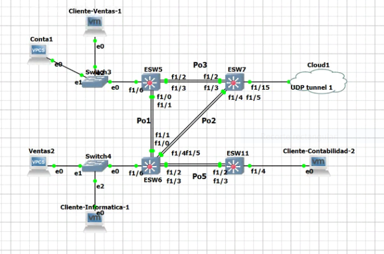
    <p align="center">Diseño Topología 3</p>
</div>

```bash
-------------------------------------------- port-channel
-------- SW5
conf t

int range f1/0 -1
channel-group 1 mode on
exit

int range f1/2 -3
channel-group 3 mode on
exit

end
------------ 
-------- SW6
conf t

int range f1/0 -1
channel-group 1 mode on
exit

int range f1/4 -5
channel-group 2 mode on
exit

int range f1/2 -3
channel-group 5 mode on
exit

end
------------ 
-------- SW7
conf t

int range f1/2 -3
channel-group 3 mode on
exit

int range f1/4 -5
channel-group 2 mode on
exit

end
------------ 
-------- SW11
conf t

int range f1/2 -3
channel-group 5 mode on
exit

end
-------------------------------------------- TRONCALES
-------- SW5
conf t

int Po1
switchport mode trunk
switchport trunk allowed vlan 1,10,20,30,1002-1005
exit

int Po3
switchport mode trunk
switchport trunk allowed vlan 1,10,20,30,1002-1005
exit

int fa1/6
switchport mode trunk
switchport trunk allowed vlan 1,10,20,30,1002-1005
exit

end
------------ 
-------- SW6
conf t

int Po1
switchport mode trunk
switchport trunk allowed vlan 1,10,20,30,1002-1005
exit

int Po2
switchport mode trunk
switchport trunk allowed vlan 1,10,20,30,1002-1005
exit

int Po5
switchport mode trunk
switchport trunk allowed vlan 1,10,20,30,1002-1005
exit

int fa1/6
switchport mode trunk
switchport trunk allowed vlan 1,10,20,30,1002-1005
exit

end
------------ 
-------- SW7
conf t

int Po2
switchport mode trunk
switchport trunk allowed vlan 1,10,20,30,1002-1005
exit

int Po3
switchport mode trunk
switchport trunk allowed vlan 1,10,20,30,1002-1005
exit

int fa1/15
switchport mode trunk
switchport trunk allowed vlan 1,10,20,30,1002-1005
exit

end
------------ 
-------- SW11
conf t

int Po5
switchport mode trunk
switchport trunk allowed vlan 1,10,20,30,1002-1005
exit

end
-------------------------------------------- VTP
-------- SW5
conf t

vtp domain grupo26
vtp password grupo26
vtp mode client

end
------------ 
-------- SW6
conf t

vtp domain grupo26
vtp password grupo26
vtp mode client

end
------------ 
-------- SW7
conf t

vtp domain grupo26
vtp password grupo26
vtp mode client

end
------------ 
-------- SW11
conf t

vtp domain grupo26
vtp password grupo26
vtp mode client

end
-------------------------------------------- SAVE
copy running-config startup-config
```

## **Configuración VPN**<a name="idVPN"></a>
### Google Cloud Platform 

Para la creación de nuestro servidor VPN se utilizo una máquina virtual en Google Cloud. 

* Creamos un regla de Firewall para nuestro proyecto. 

<div align="center">
    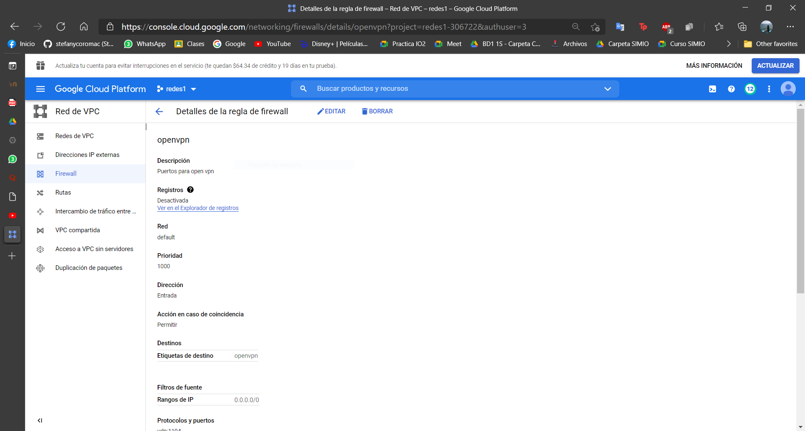
    <p align="center">Nueva regla de Firewall para el puerto 1194</p>
</div>

* Creamos una instancia de Máquina Virtual. 

<div align="center">
    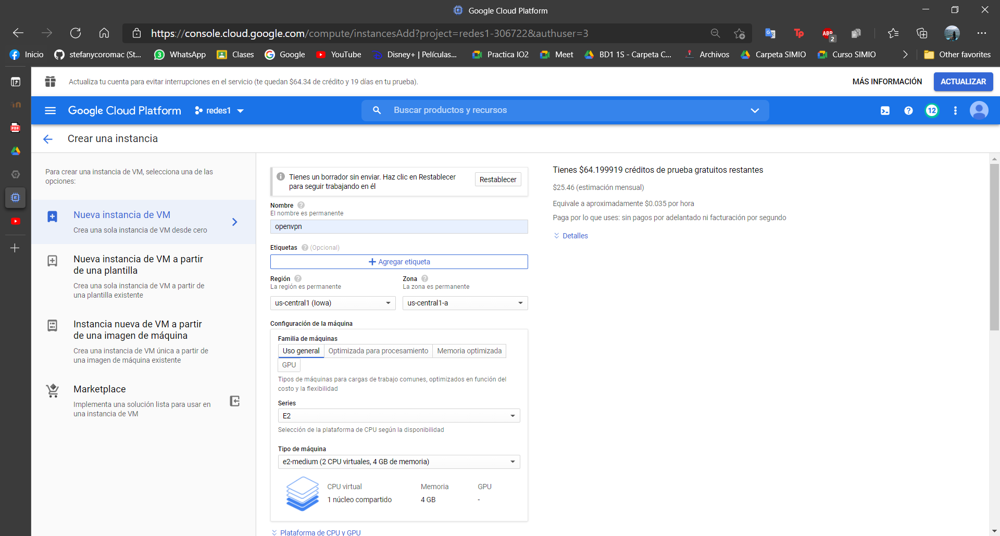
    <p align="center">Nombre de Máquina Virtual</p>
</div>

<div align="center">
    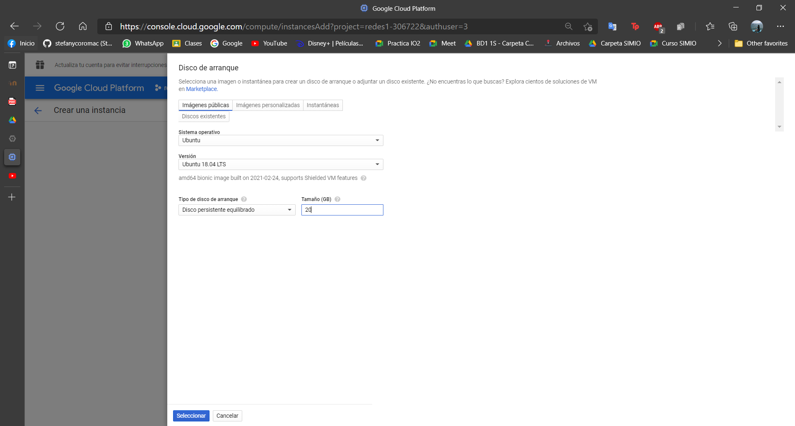
    <p align="center">Sistema Operativo Ubuntu </p>
</div>

<div align="center">
    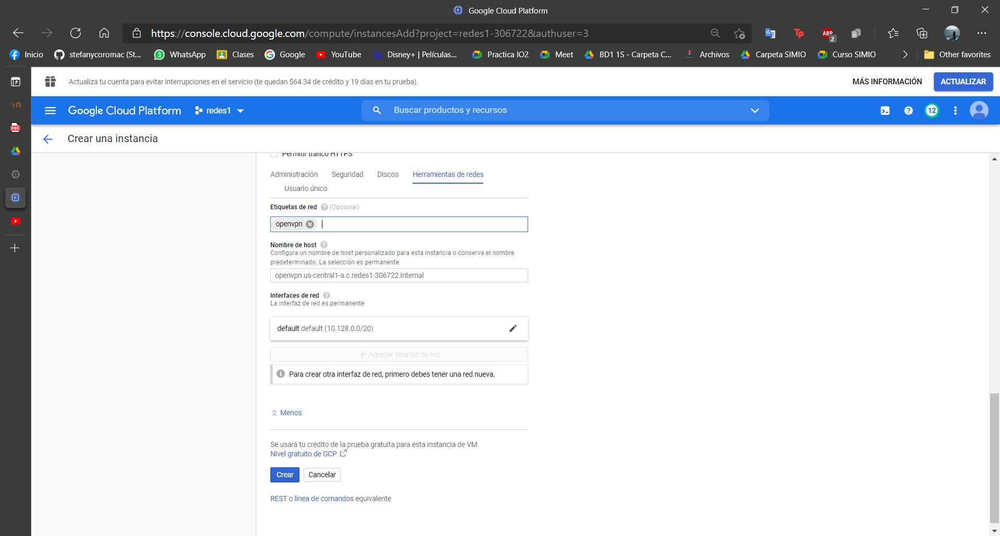
    <p align="center">Configuración de etiqueta de red</p>
</div>
    

* Ejecutar los siguientes comandos en la Máquina Virtual. 

```bash
sudo apt-get update 
sudo apt-get upgrade
```

* Instalar OpenVPN. 

```bash
sudo wget https://skiddow.github.io/OpenVPN/openvpn-install.sh
sudo bash openvpn-install.sh
```

*  Ingresar la Dirección Privada. 

<div align="center">
    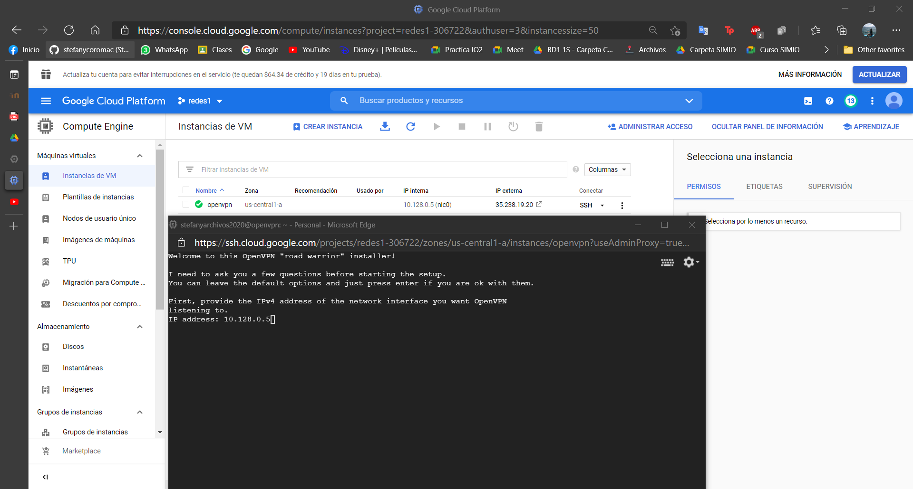
    <p align="center">Ingresar IP interna asignada por GCP</p>
</div>

* Ingresar la Dirección Pública.

<div align="center">
    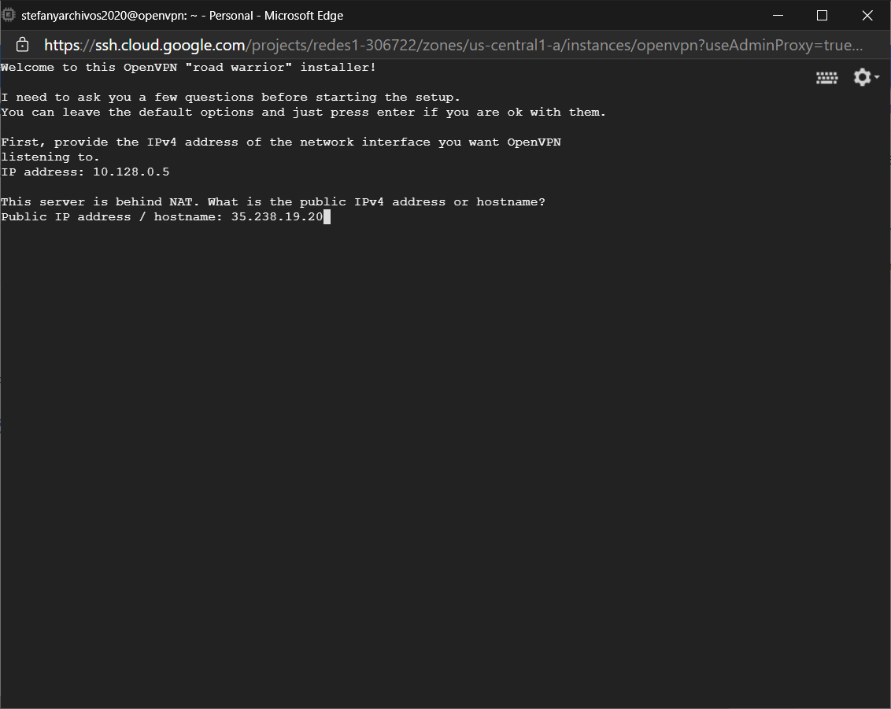
    <p align="center">Ingresar IP externa asignada por GCP</p>
</div>

* Elegir el protocolo a utilizar.

<div align="center">
    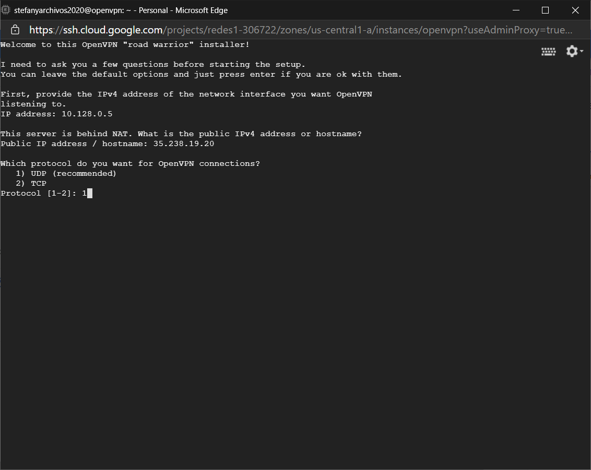
    <p align="center">Protocolo UDP</p>
</div>

*  Elegir el puerto que utilizara OpenVPN. 

<div align="center">
    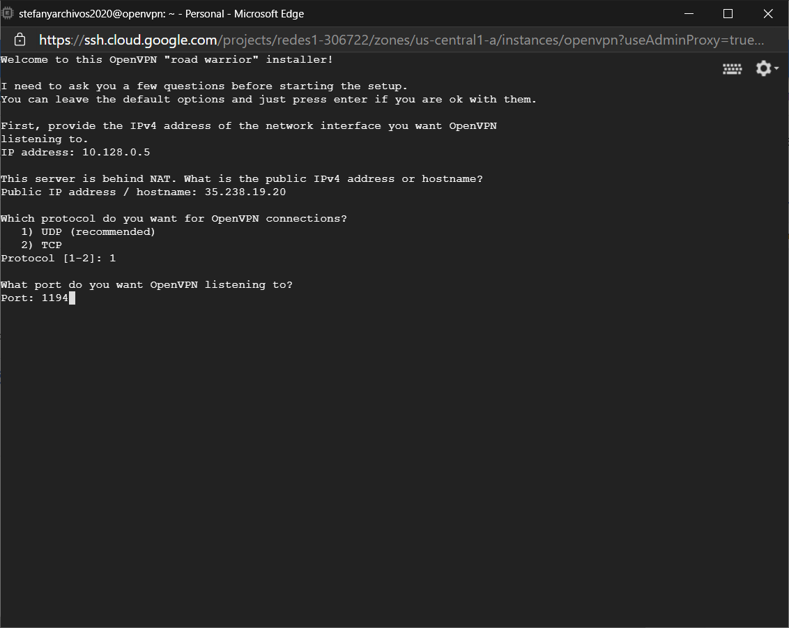
    <p align="center">Puerto 1194 configurado en la regla de Firewall</p>
</div>

* Elegir DNS a utilizar.

<div align="center">
    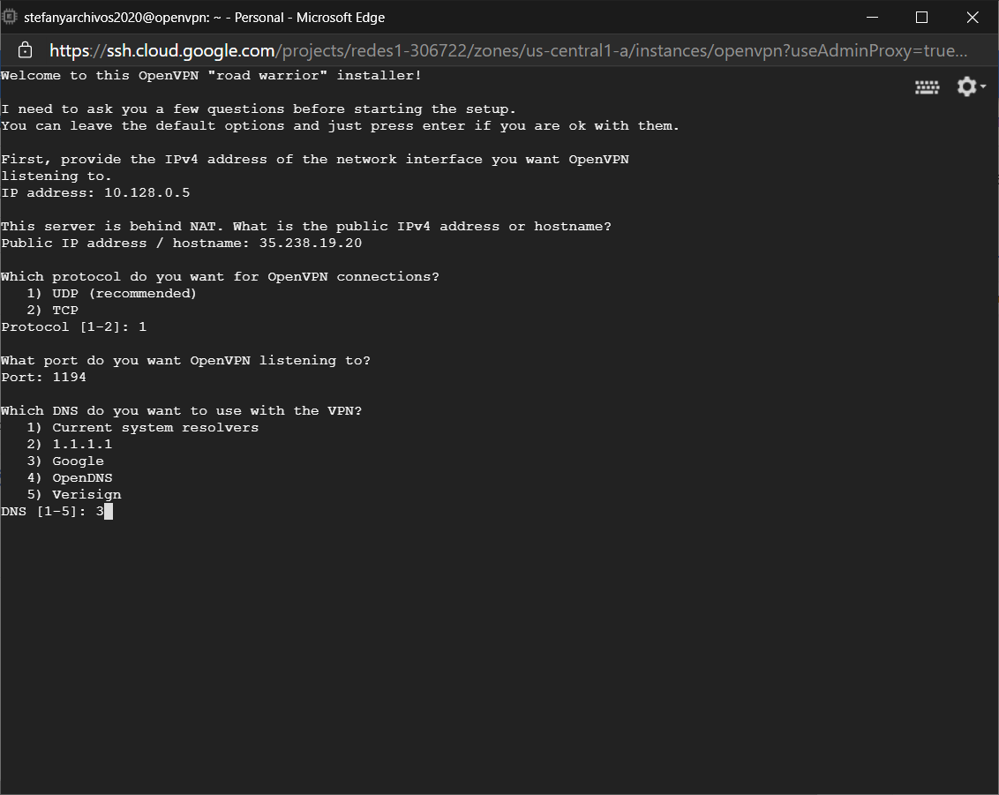
    <p align="center">Se utiliza Google</p>
</div>

*  Nombre del cliente que se va a conectar. 

<div align="center">
    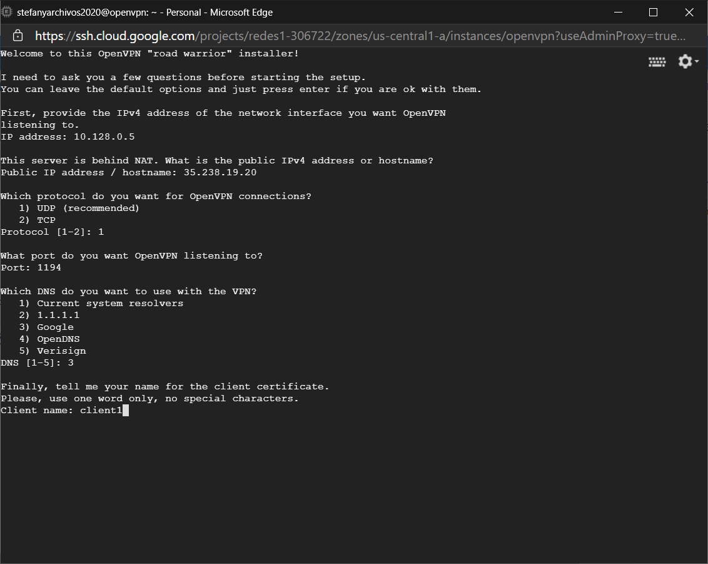
    <p align="center">client1</p>
</div>


* Una vez finalizado el proceso de creación del cliente se descarga el archivo generado.  

<div align="center">
    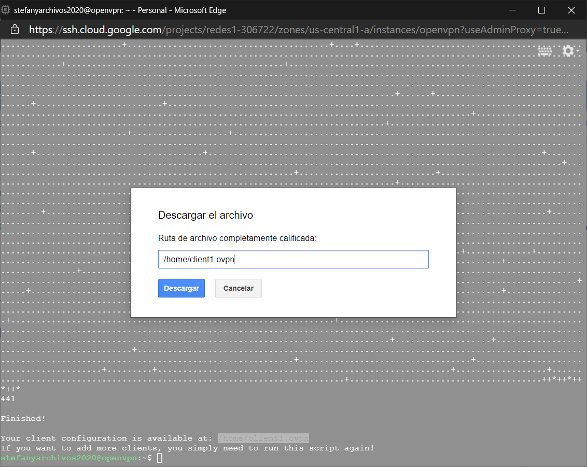
    <p align="center">Descargar archivo de client1</p>
</div>

*  Creamos otro cliente.

<div align="center">
    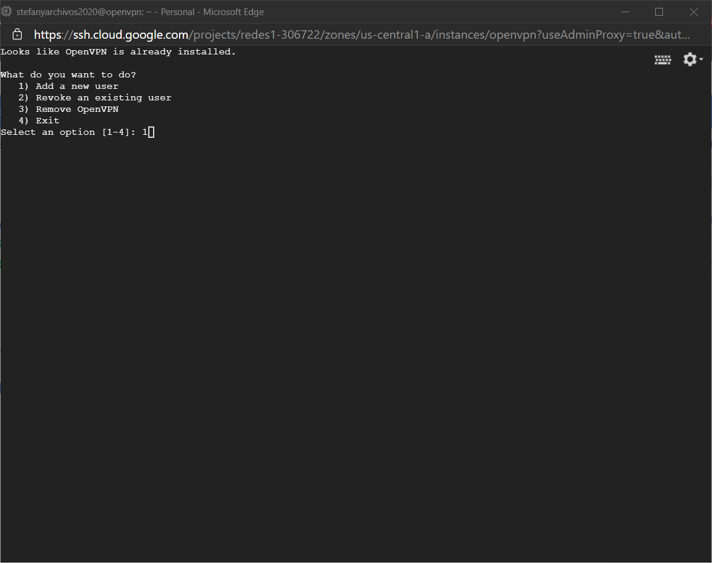
    <p align="center">Opción 1</p>
</div>

<div align="center">
    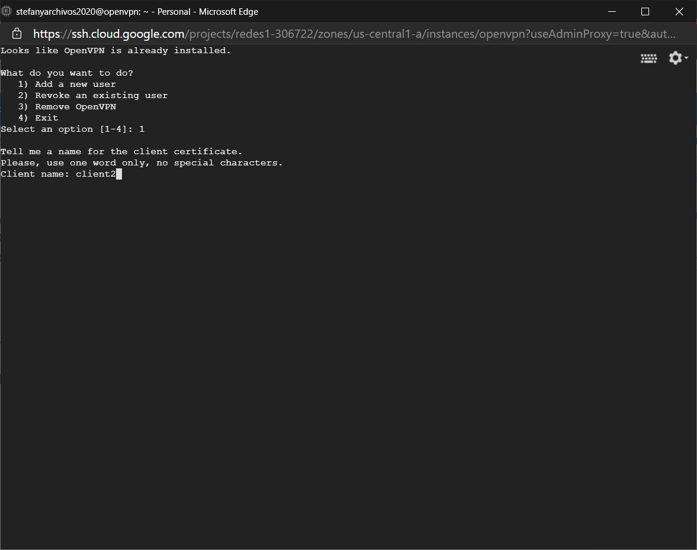
    <p align="center">client2</p>
</div>

* Una vez finalizado el proceso de creación del cliente se descarga el archivo generado.  

<div align="center">
    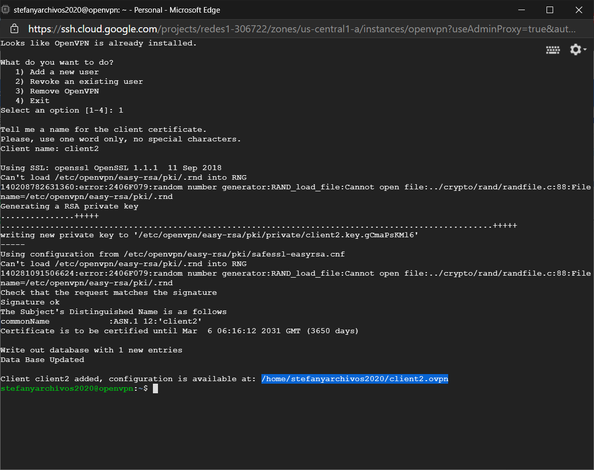
    <p align="center">Descargar archivo de client2</p>
</div>
